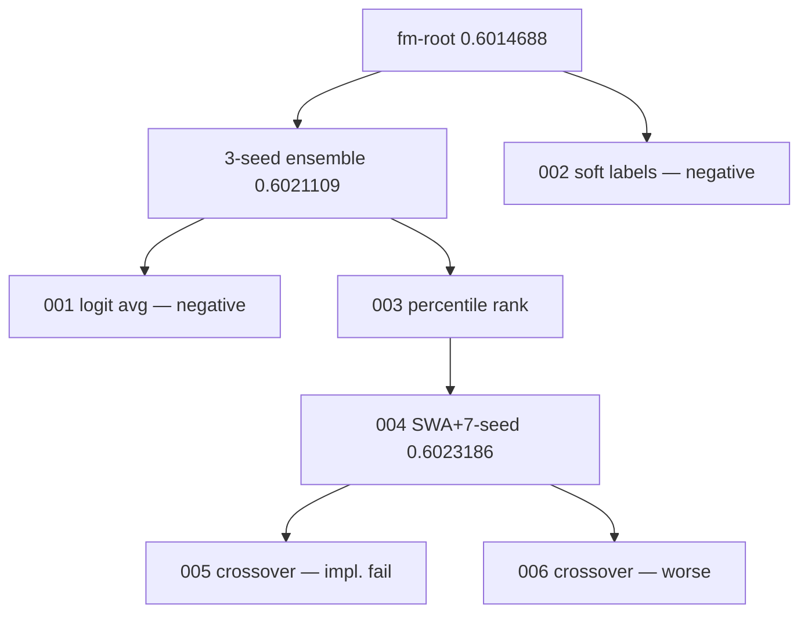

# TikTok TechJam 2026 — Autonomous ML research agent

**Track 2.** KuaiRand-Pure within-user ranking (GAUC, nDCG@5, primary = mean of both).

Gemini acts as a **semantic research operator**. A **deterministic controller** owns experiment survival, diversity, lineage, and budgets.

This is not generic AutoML.

## 60-second brief

1. **Problem.** Recommender research is a slow human loop: hypothesize, code, train, read official metrics, repeat.
2. **Novelty.** The LLM proposes hypotheses, mutations, crossovers, and repairs. It does **not** pick elites. The Evolution Controller does **not** invent ML ideas.
3. **How it works.** Research state → Gemini → generated candidate → isolated runner → official `evaluate.py` → registry → population / elite / budgets → next state.
4. **Evidence (validation only).** Under the same priors and six new evaluations, evolutionary search found an extra improvement; matched sequential search did not beat the starting elite. A later sprint, run after an independent audit fixed three search blind spots, improved it again. The final candidate is the first here to clear a 95% paired bootstrap interval against the FM root. We do **not** claim significance over the previous candidate.
5. **Reproduce.** `pytest` is free. Live Gemini needs `GEMINI_API_KEY`. Commands: [`docs/TESTING_INSTRUCTIONS.md`](docs/TESTING_INSTRUCTIONS.md).


## Results

Exact values: [`docs/evidence/canonical_benchmark.json`](docs/evidence/canonical_benchmark.json). Display strings below are rounded from that file.

| Method | Priors | New evals | Best primary | Δ vs FM | Δ vs starting elite |
| --- | --- | --- | --- | --- | --- |
| Reproduced FM | none | 0 | **0.6014688** | 0 | — |
| Phase 3 sequential (3-seed bagging) | FM | 3 | **0.6021109** | +0.0006422 | +0.0006422 |
| Phase 4 matched sequential | FM + 3-seed | 6 | **0.6021109** | +0.0006422 | 0 |
| Phase 4 evolutionary search | FM + 3-seed | 6 | **0.6023186** | +0.0008499 | **+0.0002077** |
| Sprint 2 evolutionary search | + SWA7 elite | 7 | **0.6029037** | +0.0014350 | **+0.0005851** |

Under the same prior knowledge and six new experiment evaluations, evolutionary search found an additional validation improvement while the matched sequential search did not surpass the starting elite.

Phase 4 candidate: 7-seed official FM, top-2 checkpoint SWA per seed, mean of raw FM scores. Frozen in-repo as `src/research_agent/recommenders/fm_swa7_ensemble_scorer.py`. Same-seed valid re-run matched **0.6023186** exactly. **Superseded** by the sprint-2 candidate below, and kept as historical evidence.

Phase 4 evolution resources: 6 LLM calls, 139830 tokens, ~33 min, 0 GPU-hours, **0 manual interventions**. Live model: Gemini 3.6 Flash (intended: 3.7 Flash; Developer API returned high-demand).



### Sprint 2 — after an independent audit of the search space

An independent second-opinion review (Opus) found three blind spots: regularization and the
training objective were unreachable, `parent + alpha * residual` was a degenerate safe
hill-climb that could not lose, and blank diversity metadata had silently disabled duplicate
suppression and crossover. It also found a runtime bug that made every ranking-objective
attempt time out rather than produce evidence. After fixing those **affordances** — not the
architecture — one further autonomous sprint ran with the frozen 0.6023186 candidate as a
starting prior.

The agent reached both named axes by itself. It tested a within-user listwise softmax
objective on the new machinery (a real negative result at last, not a timeout), introduced
tier-adaptive L2 unprompted, and independently rediscovered that varying embedding dimension
does not help. It stopped on **convergence** with budget remaining: 7 of 8 evaluations,
46 min, 0 GPU, **0 manual interventions**.

**Final candidate** (`final-tiered-ensemble`): 8 FM members, top-2 checkpoint SWA each,
averaged as raw FM scores, tiered by train-row selection *and* L2 strength. Frozen as
`src/research_agent/recommenders/tiered_ensemble_scorer.py`.

Paired user bootstrap, 2000 reps:

| Comparison | Δ | 95% CI | P(Δ>0) |
| --- | --- | --- | --- |
| vs FM root | +0.0014350 | [+0.00026, +0.00262] | **0.990** |
| vs Phase 4 SWA7 | +0.0005851 | [−0.00034, +0.00150] | 0.888 |

It is the first candidate here to clear 95% against the FM root. Against the previous
candidate the interval includes zero, so **no significance is claimed there**.

It is also cheaper on the same harness despite having one more member: **173.9s vs 225.0s**
on valid (−22.7%), 208.6s vs 216.7s on test (−3.7%). 0 GPU-hours.

**Test observation, after the freeze.** Selection was closed on validation; the candidate then
ran on test **once** for the official CSV. Test primary **0.5963754** vs the superseded
candidate's 0.5963862 — the validation gain **did not transfer**. That −0.0000109 difference is
35× smaller than the paired test bootstrap SD, P(Δ>0)=0.515: on test the two are
**statistically indistinguishable**. The validation-selected candidate was kept anyway, because
swapping it on the strength of a test number is precisely the test-driven selection this
project forbids.

Details: [`docs/SECOND_OPINION_SPRINT.md`](docs/SECOND_OPINION_SPRINT.md) and
[`docs/BENCHMARK.md`](docs/BENCHMARK.md).

## Reproduce

```powershell
python -m venv .venv
.\.venv\Scripts\python.exe -m pip install "numpy>=1.26,<3" pytest
.\.venv\Scripts\python.exe -m pytest tests -q
```

`pytest` spends **no** API money.

KuaiRand-Pure is not in git. Download steps and every paid vs free command: [`docs/TESTING_INSTRUCTIONS.md`](docs/TESTING_INSTRUCTIONS.md).

Frozen validation candidate (CPU, no Gemini, ~3 minutes):

```powershell
.\.venv\Scripts\python.exe scripts\run_final_candidate.py --split valid
```

Superseded Phase 4 candidate, kept reproducible as historical evidence:

```powershell
.\.venv\Scripts\python.exe scripts\run_final_candidate.py --split valid --legacy-swa7
```

Official test CSV **after** freeze only:

```powershell
.\.venv\Scripts\python.exe scripts\run_final_candidate.py --split test --allow-test
.\.venv\Scripts\python.exe scripts\make_submission.py --scores runs\final-tiered-ensemble-test\scores.npy --split test --output submission.csv
.\.venv\Scripts\python.exe starter\kuairand\submit.py --check --split test --data_dir starter\kuairand\KuaiRand-Pure\data submission.csv
```

Do not use test scores to select experiments. `submission.csv` is gitignored.

## Generated code: threat model

**Generated candidate code is not isolated from the host.** It runs as ordinary
Python in a subprocess with the same privileges as the agent, and it can read
and write anything that user can. Real isolation of arbitrary generated code
requires an OS-level boundary — a separate low-privilege user, a container, or
seccomp — which this project does not have. That is tracked as follow-up work,
not something claimed here.

What *is* enforced is narrower, and it is the property the research result
depends on: **a candidate cannot quietly change the answer, and it is not given
the agent's credentials.**

| Control | Guarantee |
| --- | --- |
| Integrity manifest | The evaluator, starter, `src/research_agent`, and dataset assets are SHA-256 hashed in the parent process before and after every attempt, against a baseline taken once per session and never re-derived. Any added, removed, or modified file fails the attempt as `status="invalid"` with `failure.kind="integrity"`, checked *before* the scores are read — so a tampered run never reaches the evaluator and never publishes a metric. A violation latches: the tree stays failed until a human restores it, so a mutation that survives one run cannot become the next run's accepted baseline. Every result records `protected_manifest_sha256`. |
| Early evaluator binding | The official `evaluate` and `data` modules are imported before any candidate runs, and binding failure invalidates the attempt rather than deferring. Once resolved in `sys.modules` they cannot be re-resolved, so a replaced source file or planted bytecode cannot steer scoring. |
| Environment allowlist | The candidate subprocess environment is built from `{}` and receives only allowlisted names (`PATH`, locale, CPU/thread pins, Windows `SystemRoot`). No Gemini/OpenAI/Anthropic/GitHub/cloud credential is passed to generated code. Thread pins are forwarded deliberately: they change float reduction order and therefore reproducibility. |
| Attempt layout | Candidate output goes to `attempts/<id>/out/`, its working directory and temp files to `work/` and `tmp/`. `metadata.json` and `result.json` are written only by the parent, so provenance is not interleaved with candidate output. |

This is detection and result invalidation, not containment. It holds because
the checks run in the parent process, outside the candidate — not because the
candidate is prevented from acting.

The AST checks in `agent/safety.py` are **advisory lint**, not a boundary. They
give the proposer fast feedback and catch honest mistakes; a split string walks
straight past them, which `test_advisory_lint_is_not_relied_on_as_containment`
pins deliberately so the checks are not re-promoted to a security control.

## Limitations

- Matched pilot is six new evaluations, not 50.
- Primary delta vs the starting elite is +0.0005851, below organizer ε=0.002. No significance claim against the previous candidate.
- NumPy-only environment blocked silent torch/deep-model “wins”.
- Crossover did not beat the best mutation in the first live pilot. It did in sprint 2.
- Gemini 3.7 Flash was capacity-blocked on the Developer API; live evidence used 3.6 Flash. That is provider resilience, not hidden human steering.
- Longer search might find more. We did not burn a 6-hour run for a likely still-sub-epsilon gain. The software still enforces 50 evals / 6h / ε=0.002 / patience=3.
- Validation itself is noisy: bootstrapping users gives an absolute primary SD of ~0.0022, about the size of organizer ε. Paired against a shared baseline it is ~0.0005. Sprint 2's +0.00059 over the previous elite beats it at every seed tried but its paired interval still includes zero.
- **The validation gain did not transfer to test.** The two candidates differ by −0.0000109 there, P(Δ>0)=0.515 — indistinguishable. We kept the validation-selected one because the selection rule was fixed in advance, not because test preferred it.
- The winner's two ingredients — tiered train-row filtering and tier-adaptive L2 — are confounded in one candidate. Nobody ablated them.

The contribution is the **auditable research system**, not a huge leaderboard jump.

## Docs

| | |
| --- | --- |
| Architecture | [`docs/ARCHITECTURE.md`](docs/ARCHITECTURE.md) |
| Benchmark table | [`docs/BENCHMARK.md`](docs/BENCHMARK.md) |
| Evidence pack | [`docs/evidence/`](docs/evidence/) |
| Evolution | [`docs/EVOLUTION.md`](docs/EVOLUTION.md) |
| Failure recovery | [`docs/FAILURE_RECOVERY.md`](docs/FAILURE_RECOVERY.md) |
| Demo script | [`docs/DEMO_SCRIPT.md`](docs/DEMO_SCRIPT.md) |
| Devpost draft | [`docs/DEVPOST.md`](docs/DEVPOST.md) |
| Submission checklist | [`docs/SUBMISSION_CHECKLIST.md`](docs/SUBMISSION_CHECKLIST.md) |
| Testing | [`docs/TESTING_INSTRUCTIONS.md`](docs/TESTING_INSTRUCTIONS.md) |
| P0 sprint | [`docs/PERFORMANCE_SPRINT.md`](docs/PERFORMANCE_SPRINT.md) |
| Second-opinion audit + sprint 2 | [`docs/SECOND_OPINION_SPRINT.md`](docs/SECOND_OPINION_SPRINT.md) |
| Research-space audit | [`docs/RESEARCH_SPACE_AUDIT.md`](docs/RESEARCH_SPACE_AUDIT.md) |

Official starter: `starter/kuairand/` (organizer files; do not edit `evaluate.py`). Fingerprint: `ecfde28392eb14fec4f488083251df50624e1af2b86278b962daecfb42d195de`.
