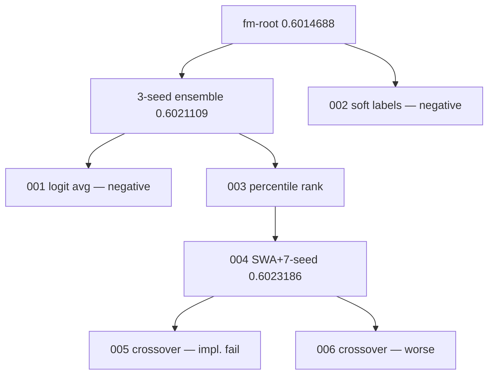

# TikTok TechJam 2026 — Autonomous ML research agent

**Track 2.** KuaiRand-Pure within-user ranking (GAUC, nDCG@5, primary = mean of both).

Gemini acts as a **semantic research operator**. A **deterministic controller** owns experiment survival, diversity, lineage, and budgets.

This is not generic AutoML.

## 60-second brief

1. **Problem.** Recommender research is a slow human loop: hypothesize, code, train, read official metrics, repeat.
2. **Novelty.** The LLM proposes hypotheses, mutations, crossovers, and repairs. It does **not** pick elites. The Evolution Controller does **not** invent ML ideas.
3. **How it works.** Research state → Gemini → generated candidate → isolated runner → official `evaluate.py` → registry → population / elite / budgets → next state.
4. **Evidence (validation only).** Under the same priors and six new evaluations, evolutionary search found an extra improvement; matched sequential search did not beat the starting elite. We do **not** claim statistical significance.
5. **Reproduce.** `pytest` is free. Live Gemini needs `GEMINI_API_KEY`. Commands: [`docs/TESTING_INSTRUCTIONS.md`](docs/TESTING_INSTRUCTIONS.md).


## Results

Exact values: [`docs/evidence/canonical_benchmark.json`](docs/evidence/canonical_benchmark.json). Display strings below are rounded from that file.

| Method | Priors | New evals | Best primary | Δ vs FM | Δ vs starting elite |
| --- | --- | --- | --- | --- | --- |
| Reproduced FM | none | 0 | **0.6014688** | 0 | — |
| Phase 3 sequential (3-seed bagging) | FM | 3 | **0.6021109** | +0.0006422 | +0.0006422 |
| Phase 4 matched sequential | FM + 3-seed | 6 | **0.6021109** | +0.0006422 | 0 |
| Phase 4 evolutionary search | FM + 3-seed | 6 | **0.6023186** | +0.0008499 | **+0.0002077** |

Under the same prior knowledge and six new experiment evaluations, evolutionary search found an additional validation improvement while the matched sequential search did not surpass the starting elite.

Final candidate: 7-seed official FM, top-2 checkpoint SWA per seed, raw probability average. Frozen in-repo as `src/research_agent/recommenders/fm_swa7_ensemble_scorer.py`. Same-seed valid re-run matched **0.6023186** exactly.

Phase 4 evolution resources: 6 LLM calls, 139830 tokens, ~33 min, 0 GPU-hours, **0 manual interventions**. Live model: Gemini 3.6 Flash (intended: 3.7 Flash; Developer API returned high-demand).



## Reproduce

```powershell
python -m venv .venv
.\.venv\Scripts\python.exe -m pip install "numpy>=1.26,<3" pytest
.\.venv\Scripts\python.exe -m pytest tests -q
```

`pytest` spends **no** API money.

KuaiRand-Pure is not in git. Download steps and every paid vs free command: [`docs/TESTING_INSTRUCTIONS.md`](docs/TESTING_INSTRUCTIONS.md).

Frozen validation candidate (CPU, no Gemini, several minutes):

```powershell
.\.venv\Scripts\python.exe scripts\run_final_candidate.py --split valid
```

Official test CSV **after** freeze only:

```powershell
.\.venv\Scripts\python.exe scripts\run_final_candidate.py --split test --allow-test
.\.venv\Scripts\python.exe scripts\make_submission.py --scores runs\final-swa7-ensemble-test\scores.npy --split test --output submission.csv
```

Do not use test scores to select experiments. `submission.csv` is gitignored.

## Untrusted candidate execution

Generated candidate code is treated as untrusted. Anything it could do to
inflate its own score, or to read the agent's credentials, is blocked in the
runtime -- not by scanning the generated source, which is defeated by string
concatenation or `exec` of a computed string.

| Layer | What it does |
| --- | --- |
| Environment allowlist | The subprocess environment is built from `{}` and receives only allowlisted names (`PATH`, locale, CPU/thread pins, Windows `SystemRoot`). No Gemini/OpenAI/Anthropic/GitHub/cloud credential reaches a candidate. |
| Write boundary | A CPython audit hook (`experiments/candidate_guard.py`) confines every filesystem primitive to the attempt's `out/`, `work/`, and `tmp/` directories. |
| Read boundary | Reads are allowlisted too -- stdlib, site-packages, the experiment inputs, the candidate's own file. Otherwise stripping the environment is theatre: the candidate reads the secrets back from `/proc/<ppid>/environ`, `~/.aws/credentials`, or the repo `.env`. |
| Integrity verification | Evaluator, starter, `src/research_agent`, and dataset assets are SHA-256 hashed before and after every attempt. Any added, removed, or modified file fails the run as `status="invalid"` with `failure.kind="integrity"` -- it never reaches the evaluator and never publishes a metric. Each result records `protected_manifest_sha256`. |

Four properties carry the boundary:

- **Audit events are default-deny.** Only events that cannot touch the
  filesystem, spawn a process, or load native code are allowed. Enumerating
  *dangerous* events does not work: `sqlite3.connect` writes a database from C
  without raising a single `open` event, and on Windows `shutil.copy2` raises
  only `_winapi.CopyFile2`. A real scorer raises 12 distinct events, so the
  allow list is small and stable.
- **Paths must be absolute.** A POSIX `*at` syscall resolves a relative path
  against a `dir_fd` while the hook would resolve it against the process cwd,
  so a relative path cannot be validated soundly. Absolute paths make `dir_fd`
  irrelevant by definition.
- **Nothing the hook depends on is reachable from candidate code.** Helpers and
  stdlib callables are captured as closure locals at install time; otherwise
  rebinding `os.path.realpath` or a module-level helper via `sys.modules` makes
  the hook validate a different path than the kernel acts on.
- **The integrity baseline is latched.** It is taken once per session and never
  re-derived, so a mutation that survives one run cannot become the next run's
  accepted baseline. Once tripped, every later attempt in that session fails
  too. The parent also binds the official evaluator before any candidate runs,
  so planted bytecode cannot be loaded later.

The AST checks in `agent/safety.py` remain, demoted to advisory lint that gives
the proposer fast feedback.

Consequence for candidates: write only to the directory of `--output-scores`,
use absolute paths, and stay single-process. `tests/test_candidate_sandbox.py`
covers direct writes, `../` traversal, absolute paths, symlink escape,
rename/replace, `shutil.copy2`, `exec` of computed source, dynamic import via
`getattr`, subprocess-based mutation, `ctypes`, native writers (`sqlite3`,
`dbm`), stdlib rebinding, out-of-sandbox reads, and the latched baseline.

## Limitations

- Matched pilot is six new evaluations, not 50.
- Primary delta vs the starting elite is +0.0002077, below organizer ε=0.002. No significance claim.
- NumPy-only environment blocked silent torch/deep-model “wins”.
- Crossover did not beat the best mutation in the first live pilot.
- Gemini 3.7 Flash was capacity-blocked on the Developer API; live evidence used 3.6 Flash. That is provider resilience, not hidden human steering.
- Longer search might find more. We did not burn a 6-hour run for a likely still-sub-epsilon gain. The software still enforces 50 evals / 6h / ε=0.002 / patience=3.

The contribution is the **auditable research system**, not a huge leaderboard jump.

## Docs

| | |
| --- | --- |
| Architecture | [`docs/ARCHITECTURE.md`](docs/ARCHITECTURE.md) |
| Benchmark table | [`docs/BENCHMARK.md`](docs/BENCHMARK.md) |
| Evidence pack | [`docs/evidence/`](docs/evidence/) |
| Evolution | [`docs/EVOLUTION.md`](docs/EVOLUTION.md) |
| Failure recovery | [`docs/FAILURE_RECOVERY.md`](docs/FAILURE_RECOVERY.md) |
| Demo script | [`docs/DEMO_SCRIPT.md`](docs/DEMO_SCRIPT.md) |
| Devpost draft | [`docs/DEVPOST.md`](docs/DEVPOST.md) |
| Submission checklist | [`docs/SUBMISSION_CHECKLIST.md`](docs/SUBMISSION_CHECKLIST.md) |
| Testing | [`docs/TESTING_INSTRUCTIONS.md`](docs/TESTING_INSTRUCTIONS.md) |

Official starter: `starter/kuairand/` (organizer files; do not edit `evaluate.py`). Fingerprint: `ecfde28392eb14fec4f488083251df50624e1af2b86278b962daecfb42d195de`.
