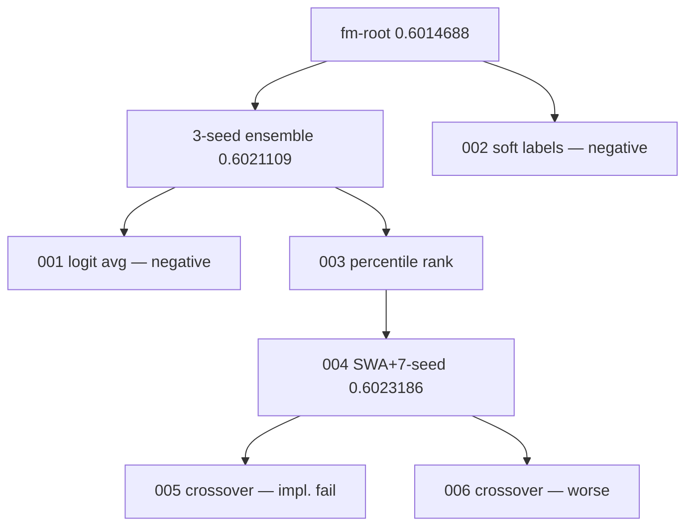

# TikTok TechJam 2026 — Autonomous ML research agent

**Track 2.** KuaiRand-Pure within-user ranking (GAUC, nDCG@5, primary = mean of both).

Gemini acts as a **semantic research operator**. A **deterministic controller** owns experiment survival, diversity, lineage, and budgets.

This is not generic AutoML.

## 60-second brief

1. **Problem.** Recommender research is a slow human loop: hypothesize, code, train, read official metrics, repeat.
2. **Novelty.** The LLM proposes hypotheses, mutations, crossovers, and repairs. It does **not** pick elites. The Evolution Controller does **not** invent ML ideas.
3. **How it works.** Research state → Gemini → generated candidate → isolated runner → official `evaluate.py` → registry → population / elite / budgets → next state.
4. **Evidence (validation only).** Under the same priors and six new evaluations, evolutionary search found an extra improvement; matched sequential search did not beat the starting elite. We do **not** claim statistical significance.
5. **Reproduce.** `pytest` is free. Live Gemini needs `GEMINI_API_KEY`. Commands: [`docs/TESTING_INSTRUCTIONS.md`](docs/TESTING_INSTRUCTIONS.md).


## Results

Exact values: [`docs/evidence/canonical_benchmark.json`](docs/evidence/canonical_benchmark.json). Display strings below are rounded from that file.

| Method | Priors | New evals | Best primary | Δ vs FM | Δ vs starting elite |
| --- | --- | --- | --- | --- | --- |
| Reproduced FM | none | 0 | **0.6014688** | 0 | — |
| Phase 3 sequential (3-seed bagging) | FM | 3 | **0.6021109** | +0.0006422 | +0.0006422 |
| Phase 4 matched sequential | FM + 3-seed | 6 | **0.6021109** | +0.0006422 | 0 |
| Phase 4 evolutionary search | FM + 3-seed | 6 | **0.6023186** | +0.0008499 | **+0.0002077** |

Under the same prior knowledge and six new experiment evaluations, evolutionary search found an additional validation improvement while the matched sequential search did not surpass the starting elite.

Final candidate: 7-seed official FM, top-2 checkpoint SWA per seed, raw probability average. Frozen in-repo as `src/research_agent/recommenders/fm_swa7_ensemble_scorer.py`. Same-seed valid re-run matched **0.6023186** exactly.

Phase 4 evolution resources: 6 LLM calls, 139830 tokens, ~33 min, 0 GPU-hours, **0 manual interventions**. Live model: Gemini 3.6 Flash (intended: 3.7 Flash; Developer API returned high-demand).



### Sprint 2 — after an independent audit of the search space

An independent second-opinion review found three blind spots (regularization and the
training objective were unreachable, `parent + alpha * residual` was a degenerate safe
hill-climb, and blank diversity metadata had silently disabled duplicate suppression and
crossover) plus a runtime bug that made every ranking-objective attempt time out rather
than produce evidence. After fixing those, one further autonomous sprint ran with the
frozen 0.6023186 candidate as a starting prior.

| Method | New evals | Best primary | Δ vs FM root | Δ vs frozen elite |
| --- | --- | --- | --- | --- |
| Sprint 2 evolutionary search | 7 | **0.6029037** | +0.0014350 | +0.0005851 |

Stopped on **convergence**, not budget. 46 min, 0 GPU, 0 manual interventions. The agent
independently reached the regularization and training-objective axes; the winner is an
8-member FM ensemble tiered by train-row selection *and* L2 strength.

Paired user bootstrap (2000 reps): vs FM root **P(Δ>0)=0.990, CI [+0.00026, +0.00262]** —
the first candidate here that clears 95% against the root. Against the frozen elite,
P=0.888 with a CI that includes zero, so no significance is claimed there.

Details: [`docs/SECOND_OPINION_SPRINT.md`](docs/SECOND_OPINION_SPRINT.md). The Phase 5
submission candidate and `submission.csv` are unchanged pending a human decision.

## Reproduce

```powershell
python -m venv .venv
.\.venv\Scripts\python.exe -m pip install "numpy>=1.26,<3" pytest
.\.venv\Scripts\python.exe -m pytest tests -q
```

`pytest` spends **no** API money.

KuaiRand-Pure is not in git. Download steps and every paid vs free command: [`docs/TESTING_INSTRUCTIONS.md`](docs/TESTING_INSTRUCTIONS.md).

Frozen validation candidate (CPU, no Gemini, several minutes):

```powershell
.\.venv\Scripts\python.exe scripts\run_final_candidate.py --split valid
```

Official test CSV **after** freeze only:

```powershell
.\.venv\Scripts\python.exe scripts\run_final_candidate.py --split test --allow-test
.\.venv\Scripts\python.exe scripts\make_submission.py --scores runs\final-swa7-ensemble-test\scores.npy --split test --output submission.csv
```

Do not use test scores to select experiments. `submission.csv` is gitignored.

## Limitations

- Matched pilot is six new evaluations, not 50.
- Primary delta vs the starting elite is +0.0002077, below organizer ε=0.002. No significance claim.
- NumPy-only environment blocked silent torch/deep-model “wins”.
- Crossover did not beat the best mutation in the first live pilot.
- Gemini 3.7 Flash was capacity-blocked on the Developer API; live evidence used 3.6 Flash. That is provider resilience, not hidden human steering.
- Longer search might find more. We did not burn a 6-hour run for a likely still-sub-epsilon gain. The software still enforces 50 evals / 6h / ε=0.002 / patience=3.
- Validation itself is noisy: bootstrapping users gives an absolute primary SD of ~0.0022, about the size of organizer ε. Paired against a shared baseline it is ~0.0005. Sprint 2's +0.00059 over the frozen elite beats it at every seed tried but its paired interval still includes zero.

The contribution is the **auditable research system**, not a huge leaderboard jump.

## Docs

| | |
| --- | --- |
| Architecture | [`docs/ARCHITECTURE.md`](docs/ARCHITECTURE.md) |
| Benchmark table | [`docs/BENCHMARK.md`](docs/BENCHMARK.md) |
| Evidence pack | [`docs/evidence/`](docs/evidence/) |
| Evolution | [`docs/EVOLUTION.md`](docs/EVOLUTION.md) |
| Failure recovery | [`docs/FAILURE_RECOVERY.md`](docs/FAILURE_RECOVERY.md) |
| Demo script | [`docs/DEMO_SCRIPT.md`](docs/DEMO_SCRIPT.md) |
| Devpost draft | [`docs/DEVPOST.md`](docs/DEVPOST.md) |
| Submission checklist | [`docs/SUBMISSION_CHECKLIST.md`](docs/SUBMISSION_CHECKLIST.md) |
| Testing | [`docs/TESTING_INSTRUCTIONS.md`](docs/TESTING_INSTRUCTIONS.md) |
| P0 sprint | [`docs/PERFORMANCE_SPRINT.md`](docs/PERFORMANCE_SPRINT.md) |
| Second-opinion audit + sprint 2 | [`docs/SECOND_OPINION_SPRINT.md`](docs/SECOND_OPINION_SPRINT.md) |
| Research-space audit | [`docs/RESEARCH_SPACE_AUDIT.md`](docs/RESEARCH_SPACE_AUDIT.md) |

Official starter: `starter/kuairand/` (organizer files; do not edit `evaluate.py`). Fingerprint: `ecfde28392eb14fec4f488083251df50624e1af2b86278b962daecfb42d195de`.
